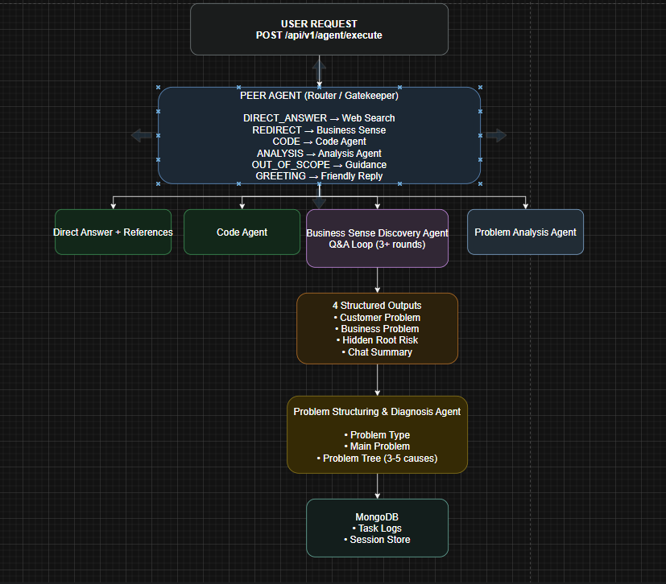
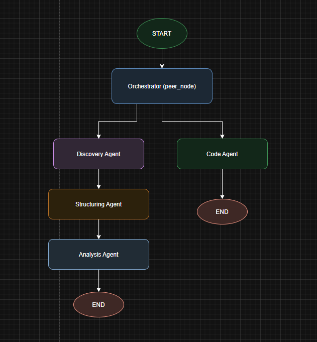

# 🤖 Peer Agent Controlled Task Distribution API

> A sophisticated multi-agent system that intelligently routes business tasks, conducts conversational problem discovery, and generates structured problem trees using LangGraph and LLM technology.

---

## 🌐 Live Demo

API is live at: **http://16.16.67.157:8001**

- Swagger UI: http://16.16.67.157:8001/docs


## ✨ Features

- **Intelligent Task Routing** — Peer Agent automatically categorizes and routes requests to the right agent
- **Conversational Problem Discovery** — Dynamic follow-up questioning to uncover root causes
- **Automated Problem Tree Generation** — Structured diagnosis with root causes and sub-causes
- **Problem Analysis Agent** — Deep-dive Q&A on generated problem trees
- **Code Generation Agent** — Professional, documented code on demand
- **Persistent Session Management** — MongoDB-backed sessions survive server restarts
- **LangGraph State Machine** — Clean, modular agent orchestration
- **Web Search Integration** — Real-time business intelligence via Tavily

---
## 💡 Initiative Taken (Beyond the Requirements)
While the assessment required a base of 3 agents, I took the initiative to design a highly extensible architecture by introducing two additional specialized nodes:
- **Code Agent:** Demonstrates how easily a non-business module can be integrated into the existing routing logic with a specialized `temperature=0.1` LLM setup for deterministic outputs.
- **Analysis Agent:** Closes the loop on the user experience. Instead of just generating a Problem Tree and stopping, the user can ask follow-up questions about the generated tree using it as RAG context.
- **Strict Intent Classification:** I decoupled the routing logic from the conversational logic to prevent the LLM from hallucinating conversational text during crucial routing steps.

---

## 🏗️ Architecture

### Agent Flow Diagram



### LangGraph State Machine



### Queue Architecture (Planned)

```
API Request → Redis Queue → Celery Worker → Agent → MongoDB
                                ↑
                           Task polling
```

> Queue implementation is planned for production. Currently, requests are processed synchronously. See [Production Recommendations](#-production-recommendations) for details.

---

## 🛠️ Tech Stack

| Technology | Purpose |
|---|---|
| **Python 3.12** | Core language |
| **FastAPI** | REST API framework with async support |
| **LangGraph** | Agent state machine orchestration |
| **LangChain** | LLM integration framework |
| **Groq (llama-3.3-70b-versatile)** | LLM — fast, free tier, high quality |
| **Tavily Search** | Real-time web search for business intelligence |
| **MongoDB + Motor** | Async database for logs and session storage |
| **Docker + Compose** | Containerized deployment |
| **GitHub Actions** | CI/CD pipeline |
| **Pydantic** | Data validation and schema definition |

---

## 🤖 Agents

### 1. Peer Agent
The system's gatekeeper. Analyzes every incoming request and routes to the appropriate agent.

**Categories:**
- `DIRECT_ANSWER` — Business knowledge questions (market, competition, trends)
- `REDIRECT` — Business problems → Discovery Agent
- `CODE` — Code generation → Code Agent
- `ANALYSIS` — Problem tree questions → Analysis Agent
- `GREETING` — Greetings and farewells
- `OUT_OF_SCOPE` — Non-business requests with redirection guidance

### 2. Business Sense Discovery Agent
Conducts structured Q&A to uncover the real root problem behind customer statements.

**Outputs:**
- `customer_stated_problem` — Problem in customer's own words
- `identified_business_problem` — Clarified, structured business problem
- `hidden_root_risk` — Unspoken risks identified through conversation
- `customer_chat_summary` — Complete conversation summary
- `questions_asked` — All questions asked during discovery

### 3. Problem Structuring & Diagnosis Agent
Transforms discovery outputs into a structured problem tree.

**Output:**
- Problem type (Growth / Cost / Operational / Technology / Regulation / Organizational / Hybrid)
- Main problem statement
- 3-5 root causes, each with 2-3 sub-causes

### 4. Problem Analysis Agent
Answers deep-dive questions about the generated problem tree using it as context.

### 5. Code Agent
Generates clean, documented, production-ready code with error handling.

---

## 🧠 LLM & Prompt Engineering

### Model Selection
**Groq llama-3.3-70b-versatile** was chosen over Gemini (rate limits) and OpenAI (cost) because:
- Generous free tier
- Sub-second response times
- Strong reasoning for business analysis tasks

### Prompt Engineering Best Practices Applied

| Practice | Implementation |
|---|---|
| **Role Prompting** | Each agent begins with a clear role definition |
| **Few-Shot Examples** | Discovery agent includes example customer responses |
| **Negative Prompting** | Explicit "do NOT" rules prevent hallucinations |
| **Output Formatting** | Structured output format enforced in every prompt |
| **Temperature Control** | 0.3 for consistency; 0.1 for code generation |
| **Chain of Thought** | Structuring agent reasons through problem types |
| **Context Injection** | Session history and problem tree passed as context |
| **Strict Output Parsing** | Forced the LLM to skip markdown blocks (```) to guarantee 100% stable string parsing. |

### Temperature Strategy
- **0.3** — Business agents (consistent, focused responses)
- **0.1** — Code agent (deterministic, reliable code output)

---

## 📦 Installation

### Prerequisites
- Python 3.12+
- Docker & Docker Compose
- Groq API Key (free at [console.groq.com](https://console.groq.com))
- Tavily API Key (free at [tavily.com](https://tavily.com))

### 1. Clone the repository
```bash
git clone https://github.com/vasfiolmez/agentic-api.git
cd agentic-api
```

### 2. Configure environment variables
```bash
cp .env.example .env
```

Edit `.env`:
```env
GROQ_API_KEY=your_groq_api_key
TAVILY_API_KEY=your_tavily_api_key
MONGODB_URL=mongodb://mongodb:27017
DATABASE_NAME=agentic_db
```

### 3. Run with Docker (Recommended)
```bash
docker-compose up --build
```

API will be available at: `http://localhost:8001`

### 4. Run Locally
```bash
python -m venv venv
venv\Scripts\activate  # Windows
source venv/bin/activate  # macOS/Linux

pip install -r requirements.txt
uvicorn app.main:app --reload
```

API will be available at: `http://localhost:8000`

---

## 🚀 Usage

### API Documentation
Visit `http://localhost:8000/docs` for interactive Swagger UI.

### Basic Request
```bash
curl -X POST http://localhost:8000/api/v1/agent/execute \
  -H "Content-Type: application/json" \
  -d '{"task": "Our sales have been declining for 3 months"}'
```

### Example Scenarios

#### 1. Business Knowledge Query
```json
POST /api/v1/agent/execute
{
  "task": "What are the latest trends in the electric vehicle sector?"
}
```

#### 2. Problem Discovery Flow
```json
POST /api/v1/agent/execute
{
  "task": "Our sales are declining, I want to understand why"
}

// Continue with same session_id
POST /api/v1/agent/execute
{
  "task": "Competitors dropped their prices 3 months ago",
  "session_id": "returned-session-id"
}
```

#### 3. Code Generation
```json
POST /api/v1/agent/execute
{
  "task": "Write Python code to read and write a file"
}
```

#### 4. Problem Tree Analysis
```json
POST /api/v1/agent/execute
{
  "task": "Can you explain the marketing inefficiency root cause in detail?",
  "session_id": "your-session-id"
}
```
#### 5. Greeting
```json
POST /api/v1/agent/execute
{
  "task": "Merhaba"
}
```

#### 6. Out of Scope
```json
POST /api/v1/agent/execute
{
  "task": "Can you give me a pizza recipe?"
}
```

---

## 📊 Logging

Two-layer logging strategy:

| Layer | Target | Purpose |
|---|---|---|
| **stdout** | Terminal / Docker logs | System events, errors, agent routing |
| **MongoDB** | `task_logs` collection | Conversation history, agent outputs |
| **MongoDB** | `sessions` collection | Persistent session state |

MongoDB was chosen because:
- Native JSON document storage matches Pydantic schemas
- Persistent sessions survive server restarts
- Easy querying of conversation history

---

## 🧪 Tests

```bash
pip install pytest pytest-asyncio
pytest tests/ -v
```

### Current Test Coverage
- `test_health_check` — API health endpoint
- `test_empty_task` — Empty task validation
- `test_peer_agent_out_of_scope` — Non-business request handling
- `test_peer_agent_direct_answer` — Business knowledge query
- `test_peer_agent_redirect` — Business problem redirects to discovery agent
- `test_code_agent` — Code generation request handling

### Expanding Test Coverage
To improve coverage, consider adding:
- Discovery agent multi-turn conversation tests
- Structuring agent output schema validation
- Analysis agent context utilization tests
- Session persistence tests (MongoDB mock)
- Integration tests for full discovery → structuring flow
- Load tests for concurrent session handling

---

## 🔄 CI/CD

GitHub Actions pipeline runs on every push to `main`:

1. **Test Job** — Runs pytest suite
2. **Deploy Job** — Triggers AWS CodeDeploy (if tests pass)

Required GitHub Secrets:
- `GROQ_API_KEY`
- `TAVILY_API_KEY`
- `AWS_ACCESS_KEY_ID`
- `AWS_SECRET_ACCESS_KEY`
- `S3_BUCKET`

**Deployment Scripts Included:**
As requested in the technical assessment, the repository includes structural DevOps files:
- `appspec.yml`: AWS CodeDeploy configuration.
- `scripts/`: Contains `BeforeInstall`, `start_application`, and `stop_application` bash scripts for seamless server deployments.

---

## 🏭 Production Recommendations

| Area | Recommendation |
|---|---|
| **Queue** | Implement Celery + Redis for async task processing |
| **Rate Limiting** | Add `slowapi` middleware (100 req/min per IP) |
| **API Versioning** | Maintain `/api/v1`, `/api/v2` simultaneously |
| **Authentication** | Add JWT token middleware |
| **Monitoring** | Prometheus + Grafana for metrics |
| **Session Storage** | Already on MongoDB |
| **Scaling** | Horizontal scaling with multiple workers |
| **Secrets** | Use AWS SSM Parameter Store for production secrets |

### Queue Architecture (When Implemented)
```
POST /api/v1/agent/execute
        ↓
   Write to Redis Queue → Return task_id
        ↓
   Celery Worker picks up task
        ↓
   Agent processes request
        ↓
   Result stored in MongoDB
        ↓
GET /api/v1/task/{task_id}
```
---

## 📄 License

This project is licensed under the MIT License.

---

## 📬 Contact

**GitHub:** [@vasfiolmez](https://github.com/vasfiolmez)

---

*Built with LangGraph, FastAPI, and Groq*
